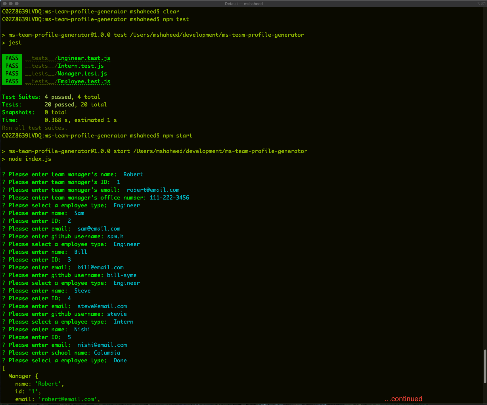
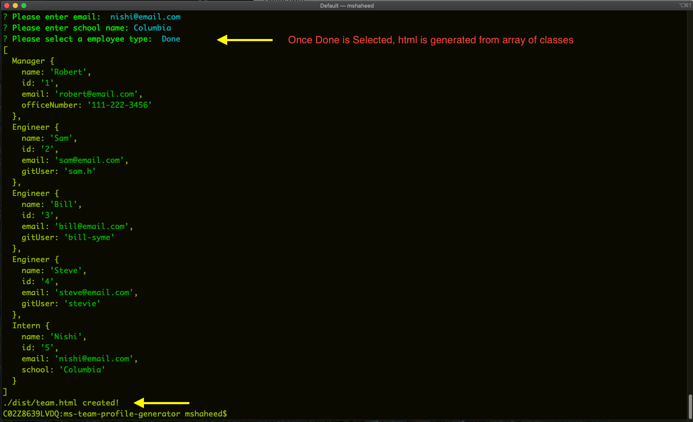
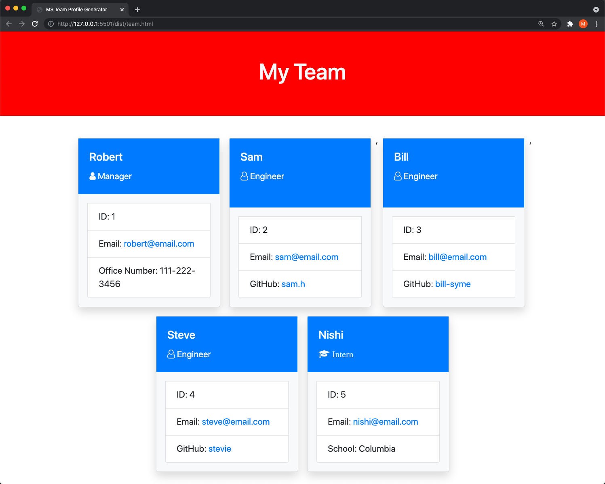

# ms-team-profile-generator


Command line interface application to generate a team profile in HTML.
## Installation

Code: [Code](https://github.com/manzur-shaheed/ms-team-profile-generator) 

You can clone code from [github link](https://github.com/manzur-shaheed/ms-team-profile-generator) and run it locally on your computer. 

#### Video Link
Watch a demo here (Quicktime Movie): [demo](https://drive.google.com/file/d/1jLAbYzBIuzytTycfBBPaeWNmKEw6ofr6/view?usp=sharing)
#### Prerequisites 
A computer with browser that supports javascript for adhoc js command testing, ```node.js``` and ```npm``` (node package manager). To clone code from github, you need to have aceess to the Internet. Also your computer should have Terminal (Unix) software installed. For Windows users, you can get it from https://www.cygwin.com/. For Mac users, it comes pre-installed with MacOS. 

#### Installing and running 
- Open a terminal.
- Create a directory for this project.
- Change current directory to this project direcory.
- Issue the following command -
```
git@github.com:manzur-shaheed/ms-team-profile-generator.git
```
- If you don't have ```node.js``` installed already then download it from [here](https://nodejs.org/en/download/), and follow the instructions to install it.
- Once installed, use ```npm``` to install ```inquirer``` package by issuing ```npm i inquirer``` command at the terminal prompt.
- Also you need ```jest``` module to perform tests on your Classes properties and methods. You can install ```jest``` by following similar instructions for ```inquirer``` in above step.
- To test your Classes properties and methods, please run ```npm test``` (specified in ```package.json``` file), or just run ```jest```.
- You can run this program by issuing ```npm start``` or ```node index.js``` command. Below is a snapshot of how I ran to produce a new readme file. An HTML file ```team.html``` will be created in the ```dist``` directory.

(shows first half of screen output)


(shows second half of screen output)


Here is output team profile HTML file.



## Testing
Please follow installation instructions and then run ```npm test``` to test various class objects.
## Contribution Guidelines
You can expand this app by adding more questions and features.
## License
MIT License

Copyright (c) 2021 Manzur Shaheed

Permission is hereby granted, free of charge, to any person obtaining a copy of this software and associated documentation files (the "Software"), to deal in the Software without restriction, including without limitation the rights to use, copy, modify, merge, publish, distribute, sublicense, and/or sell copies of the Software, and to permit persons to whom the Software is furnished to do so, subject to the following conditions:

The above copyright notice and this permission notice shall be included in all copies or substantial portions of the Software.

THE SOFTWARE IS PROVIDED "AS IS", WITHOUT WARRANTY OF ANY KIND, EXPRESS OR IMPLIED, INCLUDING BUT NOT LIMITED TO THE WARRANTIES OF MERCHANTABILITY, FITNESS FOR A PARTICULAR PURPOSE AND NONINFRINGEMENT. IN NO EVENT SHALL THE AUTHORS OR COPYRIGHT HOLDERS BE LIABLE FOR ANY CLAIM, DAMAGES OR OTHER LIABILITY, WHETHER IN AN ACTION OF CONTRACT, TORT OR OTHERWISE, ARISING FROM, OUT OF OR IN CONNECTION WITH THE SOFTWARE OR THE USE OR OTHER DEALINGS IN THE SOFTWARE.
## Contacts
#### Github
- [Manzur Shaheed](https://github.com/manzur-shaheed/)
#### Email
- [Manzur Shaheed](mailto:shaheed_manzur@yahoo.com)
## Acknowledgements
* **Billie Thompson** - [PurpleBooth](https://github.com/PurpleBooth) for the README Template.
* **Ron Erlih** [Git](https://github.com/ronerlih) for coding idea.
